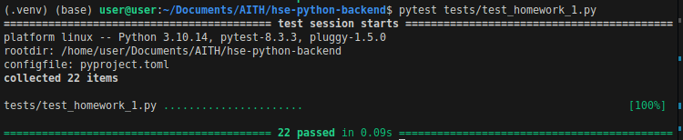

# Математическое API

## Установка зависимостей
```bash
pip install -r requirements.txt
```

## Запуск

```bash
python main.py
```
или
```bash
uvicorn app:app
```
Сервер будет доступен по адресу:

http://127.0.0.1:8000

## Автотесты:


